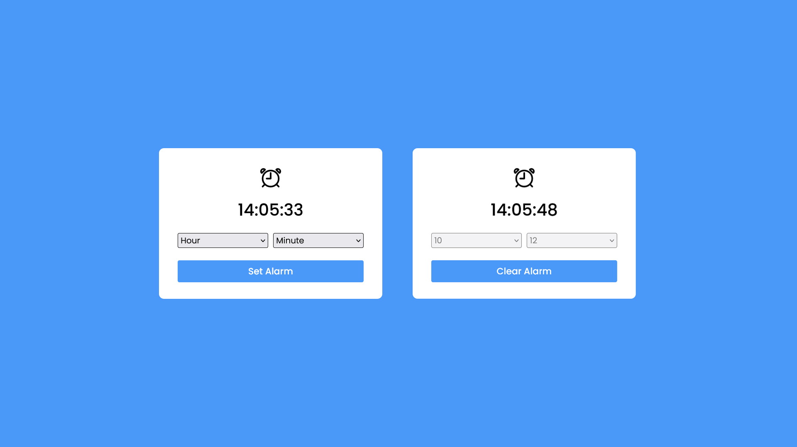

<h1 align="center">Alarm Clock</h1>

This is a JS mini project for practice.

### Screenshot

### What I learned

- <b>pointer-events</b> css property
- js audio <b>new Audio()</b> or <b>new Audio(url)</b> for creating an audio
- js audio <b>loop</b> property
- js audio <b>play()</b> method
- js audio <b>pause()</b> method

### Built with

- Semantic HTML5 markup
- CSS custom properties
- Flexbox
- Mobile-first workflow
- pure javascript
